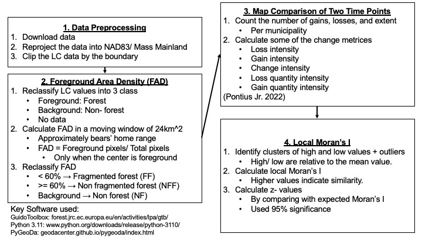
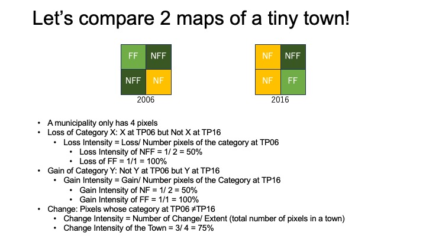
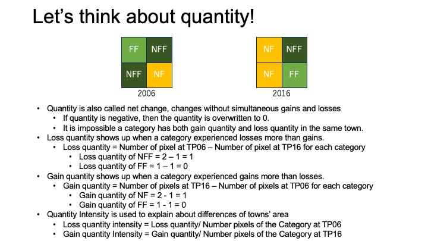
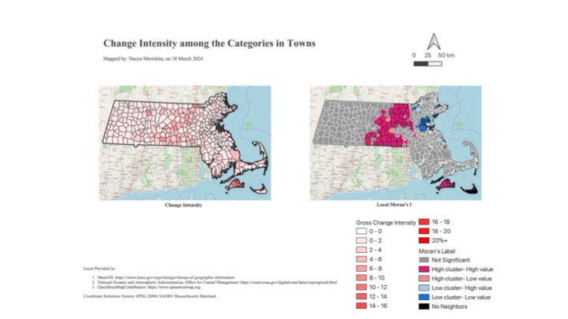

# Basic mathematics revealed forest dynamics in MA.
This will be presented at NEARC Conference on 21st May, 2024 by Naoya Morishita.
This presentation summarizes a chapter of the presenter's master thesis, submitted to Clark University.

## TODO
- Add citations
- Check paragraphs

## 0. Summary
1. I analyzed areas' change of fragmented forest, non- fragmented forest, and non- forest during the time interval of 2006 and 2016.
2. I identified clusters of high change intensities in central MA and Martha's Vineyard.
3. Future studies should focus on other land covers that affect connectivity among habitats.

## 1. Introduction
- Previous studies reported that forest loss and forest fragmentation mainly occurred in east MA.
    - It is important to note habitat fragmentation per se may provide different effect on biodiversity.
- However, I believed that they could be improved if:
    1. areas with high change and loss intensities are identified.
    2. studies defines "fragmentation" for a specific species.
- Also, there are a lot of "cool" techs, but they are often complicated.
    - Thus, simple metrices can play a role especially when presenting people with less knowledge about GIS.
- Thus, I focused on American Black Bears' minimum home range (24km^2) to identify forest fragmentation change and non- forest gain throughout MA.
    - I calculated the change intensities by municipalities.
        - It would help local governers to balance out conservation and economic development.

## 2. Data
- I used 30m regional land cover data from NOAA at the time point of 2006 and 2016. 
    - NCLD had 2021 land cover data
        - However it was avoided because I and my supervisor were concerned about too generalized data.
- I also used municipality boundary layer from MassGIS.

## 3. Methods
### 3.1 Workflow Image

### 3.2 What is foreground area intensity (FAD)?
1. I reclassified the LC layers into 3 categories:
    - Foreground (category of interest): Forest
    - Background: Non- forest
    - No data
2. GuidoToolbox calculated foreground area density.
    - We set a moving window size of approximately 24 sqkm.
    - If the center pixel is the foreground, then
        - **FAD = Number of foreground pixels/ Number of total pixels in the moving window.**
    - If the center pixel is the background, then the FAD was not calculated, and categorized as background.
3. I reclassified each pixel as follows:
    - If the FAD value was lower than 60%, then the pixel is "fragmented forest (FF)."
    - If the FAD value was more than 60%, then the pixel is "non- fragmented (NFF)."
    - If the FAD value was background, then the pixel is "non- forest (NF)"

See this document for the details.

### 3.3 What is change metrics?
- We compared the 2 maps at the time point of 2006 (TP06) and at the time point of 2016 (TP16).
    - The map contains fragmented forest, non- fragmented forest, and non- forest.

#### 3.3.1 What is change intensity?
1. Change includes gain and losses for each category.
    - **Loss of category *k*= Pixels that were *k* at TP06, but not *k* at TP16**
    - **Gain of category *k* = Pixels that were not *k* at TP06, but *k* at TP16.**
    - Note "pixels of change" are those whose categories are different between the 2 maps.
        - Thus if a pixel changed into another category and changed back to the original category during the same time interval, then it is not changed.
2. Loss intensity and gain intensity for a category of interest were calculated for each municipality:
    - **Loss intensity of *k* = Number of loss of *k*/ Total number of pixel of *k* at TP06**
    - **Gain intensity of *k* = Number of gain of *k*/ Total number of pixel of *k* at TP16**
3. I calculated change intensity, combining all categories for each municipality:
    - **Change intensity = Number of change pixel/ Number of total pixels**

#### 3.3.2 What is quantity intensity?
1. Quantity is also called net change.
2. This is a change without simultaneous loss and gain among categories.
    - **Loss quantity of category ** = Number of pixels of *k* at TP06 - Number of pixels of *k* at TP16**
    - **Gain quantity of category *j* = Number of pixels of *j* at 2016 - Number of pixels of *j* at TP06**
        - If the result is negative, then the quantity is zero.
        - If a category have the gain quantity for a municipality, then it is impossible that the category in the municipality have loss quantity more than 0.
3. The quantity intensities were calculated as below.
    - **Loss quantity intensity of *k* = Loss quantity/ Total number of pixel *k* at TP06**
    - **Gain quantity intensity of *j* = Gain quantity/ Total number of pixels of *j* at TP16.**

### 3.4 What is local Moran's I?
1. Local moran's I identifies spatial clusters of high and low values, as well as spatial outliers for each record in a vector layer.
    - Note the "high" and "low" are relative to mean value.
2. If the local moran's I is high, then the value of the record is similar to those of its neighbors, whichever the value is high or low.
    - The statistical significance was caluculated by comparing the value with an expected value.
3. By comparing the attribute values with mean, the resulting layer would highlight high clusters, low clusters, and spatial outliers.

See this webpage for the detail.

## 4. Result & Discussion
1. Looking at the change intensities of the categories, non- forest showed the largest cluster of high intensities of gains in central and western Massachusetts. Western Mass also showed a high cluster of losses, indicating that the area experienced high intensities both of gains and losses. The same was true to fragmented forests in central Mass.

2.	The change intensity showed large high clusters in central Mass, as well as on Martha’s Vineyard. Nonetheless, Worcester, the 2nd populated city in New England turned out to be spatial outliers. This indicates that the city experienced significantly lower change intensity than its neighbors.

3. Net change intensity, in other words quantity intensity in the western areas ended up high cluster of loss non- forest. This indicates that their losses were larger than their gains. Both the non- forest and fragmented forest gained intensively in central Massachusetts. 

4. From these 3 points, I would conclude that central Mass had been the most subjective to change. Unlike discussion by previous studies, the east Massachusetts, typically outskirts of Boston, ended up low clusters of changes. This may indicate that its forest change dynamics may no longer be intensive in the area than others. That may make sense if these areas have been already developed enough.

## 5. Future Direction
1.	How other land cover changed in municipalities? This is because the land cover differently affects behavior of wildlife.
2.	What are potential drivers behind the forest dynamics? One possible driver that I discussed with my supervisor is solar panel installations that typically occurred in central Mass.
3. How do parameters affect the model? For example, what if we change queen contiguity weights into distance- based weights when we do local Moran’s I?

## 6. Appendix
### 6.1 Key References

### 6.2 Awknowledgement
I would like to thank Professor John Rogan for his guidance throughout my research.