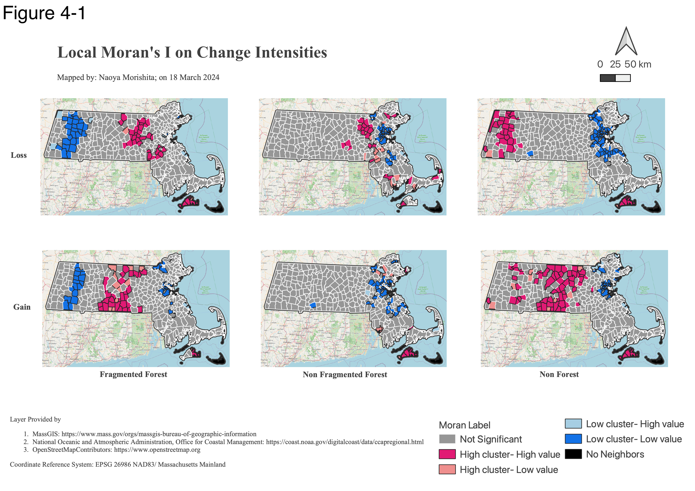
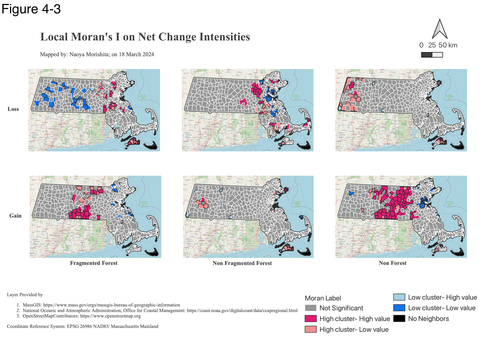

# Basic mathematics revealed forest dynamics in MA.
This will be presented at NEARC Conference on 21st May, 2024 by Naoya Morishita.
This presentation summarizes a chapter of the presenter's master thesis, submitted to Clark University.

## 0. Summary
1. I only used mathematical division, subtraction, and local Moran's I to keep simplify methods.
2. I identified clusters of high change intensity and gain quantity intensity of non- forest in central MA, not east MA.
3. Future studies should focus on other land covers that affect connectivity among habitats.

## 1. Introduction
- Massachusetts, especially east MA, experienced forest loss and fragmentation (Blumstein & Thompson, 2015; Rogan, et al., 2016).
    - There are few studies compared COMBINEDLY forest connectivity and area changes between 2 time points.
- Also, researchers developed a lot of cool tech.
    - However, it is hard to explain and explain.

## 2. Data
- [30m Land cover from NOAA](https://coast.noaa.gov/digitalcoast/data/ccapregional.html)
    - Time point of 2006 (TP06)
    - Time point of 2016 (TP16)
- [Municipaity boundaries from MassGIS](https://www.mass.gov/info-details/massgis-data-municipalities)

## 3. Methods
### 3.1 Workflow Image

### 3.2 What is foreground area intensity (FAD)?
- FAD is one of GuidoToolbox (Vogt & Riitters, 2017) functions, and it examines forest fragmentation using a moving window.
- The window size was about 24km^2, which was close to American black bears' home range (Klamath Inventory & Monitoring Network, 2021).
- If a center pixel was forest, then the software calculated FAD and rounded the value.
- FAD uses the equation of **FAD = Number of foreground pixels/ Number of total pixels in the moving window.**
- If the FAD was less than 60%, then we called the pixel fragmented forest (FF). 
- If not, then we called the pixel non- fragmented forest (NFF).
- If a center pixel is not forest, then the value is background which we called called non- forest(NFF).
- See [this documentation](https://ies-ows.jrc.ec.europa.eu/gtb/GTB/psheets/GTB-Fragmentation-FADFOS.pdf) for the detail.

### 3.3 What is change metrics?
We compared the two maps at the TP06 and TP16 using some of the metrices presented by Pontius Jr. (2022).

#### 3.3.1 Terminologies in This Research
- **Extent:** The total number of pixels in a study area which is an area of each municipality.
- **Category size of a category *k*:** The number of pixels of *k* at a given time point in the extent.
- **Losses of a category *k*:** Pixels that were *k* at TP06, but NOT *k* at TP16.
- **Gains of a category *k*:** Pixcels that were NOT *k* at TP06, but *k* at TP16.
- **Change:** Pixels whose categories were different between the time points.
    - The study compared 2 time points' maps, so this is NOT change.
        - A pixel belonged to category *k* at TP06.
        - The pixel changed to another category, and then changed back to the original category *k* by TP16.

#### 3.3.2 Category Intensity
We calculated the gain intensity and the loss intensity for each category in each municipality.
- Loss intensity = **Loss size/ Category size at TP06**
- Gain intensity = **Gain size/ Category size at TP16**

We also calculated the change intensity in each municipality
- Change intensity = **Change size/ Extent size**

#### 3.3.4 Quantity Intensity of a Category
Quantity, also called net change, excludes simultaneous gains and losses of a category.
It is impossible that one category in an extent have both positive loss and positive gain quantity.
- Loss quantity = MAXIMUM(Loss size - Gain size, 0)
    - **Loss quantity intensity = Loss quantity/ Category size at TP06**
- Gain Quantity = MAXIMUM(Gain size - Loss size, 0)
    - **Gain quantity intensity = Gain quantity/ Category size at TP16**

### 3.4 What is local Moran's I?
- Local Moran's I finds clusters containing significantly similar values (Mitchel, 2009)
- It also identifies spatial outliers (Mitchel, 2009)
- We used 5% alpha.
- Then, the significant clusters were labeled either high or low (Mitchel, 2009).
- Note that the "high" and "low" were relative to the mean value (Anselin, 2020).

See [this webpage](https://pro.arcgis.com/en/pro-app/latest/tool-reference/spatial-statistics/h-how-cluster-and-outlier-analysis-anselin-local-m.htm) for the detail.

## 4. Result & Discussion
1. **Central MA contained both high clusters of gains and losses of fragmented forest (Fig 4-1).**
    - The fragmented forest experienced intensive gains and losses in the area. The high clusters basically overlaps with those of the gains of non- forest in central MA.
2.	**Change intensity showed high clusters in central Mass in Martha's Vineyard (Fig 4-2).**
    - This indicates that change dynamics among the categories were intensive in these areas. Nonetheless, Worcester, 2nd largest city, was an spatial outlier, low value in high cluser. This implied that the intensity was significantly lower than those of its neighbors.
3. **"The outskirts of Boston" belonged to low clusters of quantity gain intensity of non- forest (Fig 4-3).**
    - This disagrees with previous discussion (Blumstein & Thompson, 2015). Instead, central MA contained high clusters of the intensity. This, in turn, implies that quantity loss intensity of forest was higher in this area. Again, Worcester was the spatial outlier. This may indicate that its forest change dynamics may no longer be intensive in the area than others. That may make sense if these areas have been already developed enough.
4. **South central MA belonged to the high cluster of the gain quantity intensity of fragmented forest (Fig 4-4).**
    - Rogan et al. (2016) observed forest fragmentation in and around populous city like Worcester. However, this study found that even towns further away from the city extensively experienced the gain quantity intensity.

*Figure 4-1*

*Figure 4-2*

*Figure 4-3*

## 5. Potential Research Questions in the Future
1. How other land cover changed in municipalities? This is because the land cover differently affects behavior of wildlife.
2. What are potential drivers behind the forest dynamics? One possible driver that I discussed with my supervisor is solar panel installations that typically occurred in central Mass  (Tao, Rogan, Ye, & Geron, 2023).
3. How do parameters affect the model? For example, what if we change queen contiguity weights into distance- based weights when we do local Moran’s I?
4. How do the fragmentation and losses affect behavior of the bears in reality? A study revealed increase of nocturnal activity of bears in MA due to urban development (Zeller, Wattles, Conlee, & Destefano, 2019).

## 6. Appendix
### 6.1 Key References
- Anselin, L. (2020, 10 12). Local Spatial Autocorrelation (1) LISA and Local Moran . Retrieved from Webpage of GeoDa: https://geodacenter.github.io/workbook/6a_local_auto/lab6a.html
- Blumstein, M., & Thompson, J. R. (2015). Land-use impacts on the quantity and configuration of ecosystem service provisioning in Massachusetts, USA. Journal of Applied Ecology, 52, 1009-1019.
- Mitchel, A. (2009). The ESRI Guide to GIS Analysis: Spatial Measurement and Statistics. California: Esri Press.
- Klamath Inventory & Monitoring Network. (2021, 07). American Black Bear. Retrieved 12 31, 2023, from Website of National Park Service U.S. Department of the Interior: https://irma.nps.gov/DataStore/DownloadFile/662401
- Pontius Jr, R. G. (2022). Metrics that make a difference. Cham, Switzerland: Springer Nature Switzerland AG.
- Rogan, J., Write, T. M., Pearsall, H., Ogneva-Himmelberger, Y., Riemann, R., Riitters, K., & Partington, K. (2016). Forest fragmentation in Massachusetts, USA: a town-level assessmentusing Morphological spatial pattern analysis and affinity propagation. GIScience & Remote Sensing, 53(4), 506-519.
- Tao, S., Rogan, J., Ye, S., & Geron, N. (2023). Mapping Photovoltaic Power Stations and Assessing their Environmental Impacts from Multi-sensor Datasets in Massachusetts. Remote Sensing Applications: Society and Environment, 30, 100937.
- Vogt, P., & Riitters, K. (2017). GuidosToolbox: universal digital image object analysis. European Journal of Remote Sensing, 50(1), 352-361.
- Zeller, K. A., Wattles, D. W., Conlee, L., & DeStefano, S. (2019). Black bears alter movements in response to anthropogenic features with time of day and season. Movement Ecology, 7, 1-14.

### 6.2 Awknowledgement
I would like to thank Professor John Rogan for his guidance throughout my research.

### 6.3 Summary (Revisited)
1. I only used mathematical division, subtraction and local Moran's I for this research to make sure methods are clear for everyone.
2. I identified clusters of high change intensities and quantity intensity of non- forest in central MA and Martha's Vineyard, not east MA.
3. Future studies should focus on other land covers that affect connectivity among habitats.

Please send any questions or feedbacks to [my email](mailto:0zh4772g325515u64@gmail) or [my LinkedIn](www.linkedin.com/in/naoya-morishita-705393254). Thank you!
